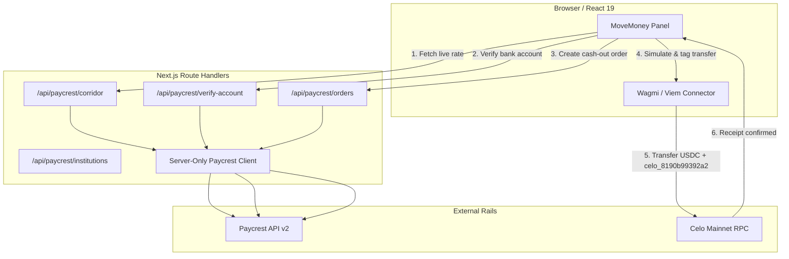

<div align="center">

# Providus

**Celo-native Nigerian payments agent & value ledger.**<br/>
*Know what arrives before you pay.*

[-FCFF52?logo=celo&logoColor=black)](https://celo.org)
[](https://8004scan.io/agents/celo/9851)
[](https://github.com/Devendurance/useprovidus)
[-4C6A9E)](https://askbots.ai/p/k172fmf6cpxbq355mzsevk3vcd8epej8)
[](https://nextjs.org/)
[](https://www.typescriptlang.org/)
[](https://paycrest.io)
[](https://github.com/Devendurance/useprovidus)

[Architecture](#3-current-shipped-architecture) • [Cash-Out Lifecycle](#4-current-cash-out-lifecycle-trace) • [Security & Controls](#8-security-financial-integrity--risk-controls) • [Testing](#9-verification--test-evidence) • [Roadmap](#10-milestone-roadmap--completion-criteria)

</div>
Providus turns Celo mainnet stablecoins into everyday Nigerian financial outcomes. It connects Celo USDC liquidity with Nigerian fiat settlement rails and local utilities, establishing a verifiable value ledger where users inspect real exchange rates, exact fees, and recipient details before approving payments.

- **GitHub Repository:** [https://github.com/Devendurance/useprovidus](https://github.com/Devendurance/useprovidus)
- **Celo Network:** Celo Mainnet (`chainId: 42220`)
- **Hackathon:** Celo Agents at Work Hackathon (`agents-at-work`)
- **ERC-8004 Agent Identity:** [Agent #9851 on 8004scan](https://8004scan.io/agents/celo/9851)
- **On-Chain Attribution Tag:** `celo_8190b99392a2` (ERC-8021 calldata suffix)
- **Agent / Payout Wallet:** `0x21E5Fc03E4305CC8CFb874253c6d66A8bdB0bcDa`
- **AskBots Quality Benchmark:** [AskBots Project k172fmf6cpxbq355mzsevk3vcd8epej8](https://askbots.ai/p/k172fmf6cpxbq355mzsevk3vcd8epej8) (Round 1 Baseline Score: 2.0/10, 10/10 completed)

---

## 1. What Providus Is

Providus is an autonomous, user-approved payment system designed for Celo. Instead of relying on headline exchange rates or custodying user funds, Providus calculates the **effective received value** of a transaction across fees, slippage, and provider constraints.

In its current shipped form, Providus enables direct cash-out from Celo USDC into any Nigerian commercial or microfinance bank account via Paycrest. In the active milestone roadmap, Providus expands to support AI payment commands and direct utility fulfilment (airtime, data, bills) via local infrastructure.

---

## 2. What Is Shipped Today vs. What Is Not Shipped

### Shipped (Production-Ready)
- **Live Celo USDC → NGN Cash-Out:** End-to-end off-ramp from Celo USDC to verified Nigerian bank accounts via Paycrest.
- **Corridor Quote Engine:** Live rates fetched from Paycrest read APIs with 30-second freshness TTL, exact decimal-string arithmetic (no floating-point rounding errors), and honest unavailable states.
- **Live Recipient Verification:** Bank list directory query and real-time NGN account name resolution (`POST /v2/verify-account`). Recipient binding is enforced before order creation.
- **Order Normalization & Amount Integrity:** Strict invariant checks comparing user-approved amounts against upstream order payloads. Discrepancies immediately reject the order.
- **ERC-8021 On-Chain Attribution:** Direct integration of `@celo/attribution-tags`. Every outbound payment calldata appends `celo_8190b99392a2` to ensure verifiable hackathon volume on Dune.
- **Canonical Circle USDC Verification:** Runtime check comparing Paycrest contract metadata against Circle's checksummed canonical contract (`0xcebA9300f2b948710d2653dD7B07f33A8B32118C`).
- **Zero-Approval Direct Transfer:** Paycrest generates a per-order deposit address; payments are direct ERC-20 `transfer(to, value)` calls without token allowance risks.
- **Safety Buffers:** 25% gas buffer check on native CELO balance, 60-second payment window safety margin before Paycrest order expiry.
- **State Safety Semantics:** Single-firing deposit confirmation callbacks and explicit `DEFINITE_FAILURE` vs `OUTCOME_UNKNOWN` failure handling.

### Not Shipped Yet (P1 Milestone Roadmap)
- **Durable Persistence / Database:** Currently zero-DB; order state is held ephemerally in client React hooks.
- **Post-Deposit Fiat Settlement Tracking:** The app verifies on-chain Celo USDC transfer receipts, but does not yet programmatically poll or receive webhooks for Paycrest NGN bank delivery.
- **ClubKonnect Utility Fulfilment:** Airtime, data, electricity, and cable VTU integrations are not yet live.
- **AI Payment Command Box:** Natural-language payment command parsing (`"Send ₦500 airtime to 080..."`) is in active development.

---

## 3. Current Shipped Architecture



---

## 4. Current Cash-Out Lifecycle Trace

1. **Quote Inspection:** User selects cash-out and enters a USDC amount. `useCorridorQuote` fetches `GET /api/paycrest/corridor?side=sell&amount=X`. The rate is valid for 30 seconds.
2. **Recipient Verification:** User enters their 10-digit NGN account number and selects their bank. `CashOutRecipient` calls `POST /api/paycrest/verify-account`. The resolved account name is returned and masked.
3. **Pre-Order Review & Creation:** User reviews the estimated NGN payout, rate, fees, and bank details. Clicking "Create cash-out order" calls `POST /api/paycrest/orders`. The server re-verifies the recipient name, generates a Providus order reference, and creates the order with Paycrest.
4. **Order Normalization:** The response is verified via `normalizeCashOutOrderResponse`. If the amount, token, or network does not match what the user approved, the order is rejected as unsafe.
5. **Pre-Flight Payment Gating:** `useUsdcDeposit` checks:
   - Order expiry window (`validUntil` minus 60s safety buffer).
   - User wallet matches refund address.
   - User USDC balance $\ge$ total USDC to send (`amount + senderFee + transactionFee`).
   - Native CELO balance covers estimated gas + 25% safety buffer.
6. **Tagged Calldata Execution:**
   - The calldata for `transfer(receiveAddress, totalUsdcToSend)` is constructed.
   - `buildTaggedTransferCalldata` appends the ERC-8021 suffix for `celo_8190b99392a2`.
   - Contract execution is simulated on Celo mainnet.
   - Wagmi's `useSendTransaction` prompts wallet approval and broadcasts the transaction.
7. **On-Chain Confirmation:** Wagmi's `useWaitForTransactionReceipt` waits for transaction inclusion. Upon success, the UI updates with the explorer link.
   - *Current Limitation:* The UI explicitly states: *"Celo USDC deposit confirmed on-chain. This confirms the Celo deposit only — not that NGN has been paid out."*

---

## 5. Directory Structure & Key Modules

```text
.
├── app/
│   ├── api/paycrest/          # Server-only Paycrest proxy endpoints
│   │   ├── corridor/route.ts  # Live rate quotes (celo / USDC / NGN)
│   │   ├── institutions/      # Bank directory listing
│   │   ├── orders/route.ts    # Safe order creation & re-verification
│   │   ├── support/route.ts   # Token & availability probe
│   │   └── verify-account/    # Bank account name verification
│   ├── check/page.tsx         # Move Money cash-out interface
│   ├── dashboard/page.tsx     # Dashboard & history view
│   └── page.tsx               # Providus home & product pillars
├── components/
│   ├── move/                  # Cash-out UI components
│   │   ├── move-money-panel.tsx
│   │   ├── cash-out-recipient.tsx
│   │   ├── cash-out-review.tsx
│   │   └── cash-out-payment.tsx
│   ├── providus/              # Value Line & visual ledger components
│   └── ui/                    # Providus design system primitives
├── hooks/
│   ├── use-account-verification.ts
│   ├── use-cash-out-order.ts   # Order state machine (idle -> confirming -> creating -> created)
│   ├── use-corridor-quote.ts   # Debounced quote polling
│   ├── use-providus-wallet.ts  # Wallet connection & Celo network guard
│   └── use-usdc-deposit.ts     # Tagged USDC transfer execution & receipt watching
├── lib/
│   ├── celo/
│   │   ├── attribution.ts      # ERC-8021 tag encoding & validation (celo_8190b99392a2)
│   │   └── usdc.ts             # Canonical Celo USDC contract definition
│   ├── money/
│   │   ├── decimal.ts          # Exact decimal-string arithmetic & formatting
│   │   └── usdc-amount.ts      # Strict crypto notional validation (max 6 decimals)
│   └── paycrest/
│       ├── order.ts            # Response normalizer, amount integrity, expiry checks
│       ├── recipient.ts        # Bank account validation & masking
│       └── server/             # Server-only client, upstream error handling, redaction
└── docs/                       # Architecture specs & hackathon registrations
```

---

## 6. Financial & Security Protections

- **Amount Integrity Guarantee:** Paycrest create-order responses are strictly checked against the user-approved amount via `decimalStringsEqual`. Upstream deviations are rejected before payment instructions are shown.
- **Safety Window (60s):** Payments cannot be submitted within 60 seconds of Paycrest's `validUntil` timestamp to prevent off-chain expiration while on-chain transactions are pending.
- **Gas Headroom (+25%):** Native CELO gas estimations are multiplied by 1.25 before balance checks to eliminate out-of-gas reverts under network congestion.
- **Failure Classification:**
  - `DEFINITE_FAILURE`: Validation rejections, recipient changes, rate limits. The order was not created; the user can safely edit and retry.
  - `OUTCOME_UNKNOWN`: Network errors, timeouts, or unverified server responses. Re-attempts are blocked in-session to prevent duplicate Paycrest orders.
- **Zero-Custody Architecture:** Providus never holds private keys, session keys, or custody of user assets. All funds move directly between the user's wallet, Circle USDC, and Paycrest deposit accounts.
- **Credential Hygiene:** Paycrest API keys remain strictly on the server. Outgoing request payloads redact PII in logs, and no secret environment variables leak into client bundles.

---

## 7. Known Architectural Gaps (Targets for P1)

1. **Durable Persistence:** Currently, all state is held in React state. Refreshing the browser loses active payment instructions. P1 adds Drizzle ORM to record transactions durably.
2. **Fiat Delivery Finality:** The application currently relies on Celo on-chain deposit confirmation. P1 introduces an automated Paycrest order status poller / webhook verifier to confirm actual NGN bank delivery.
3. **Webhook Signature Validation:** Implementation of HMAC-SHA256 signature verification for Paycrest and local provider webhooks.

---

## 8. Development & Local Testing

### Prerequisites
- Node.js 20+
- Celo Mainnet RPC access (e.g. `https://forno.celo.org`)
- Paycrest API Key (for server endpoints)

### Setup
```bash
# Clone the repository
git clone https://github.com/Devendurance/useprovidus.git
cd useprovidus

# Install dependencies
npm install

# Configure environment variables
cp env.example .env.local
# Add your server-only PAYCREST_API_KEY
```

### Run Dev Server
```bash
npm run dev
# Open http://localhost:3000
```

### Self-Check Test Suites
Providus uses standalone, deterministic test suites executed via `tsx`:

```bash
# Test wallet configuration and Celo network guards
npm run test:wallet-helpers

# Test exact decimal arithmetic, string math, and USDC formatting
npm run test:money-helpers

# Test bank institution filtering and account number validation
npm run test:recipient-helpers

# Test order normalization, fee addition, amount integrity, and payment gating
npm run test:order-helpers

# Test server-side create-order route handling and upstream error redaction
npm run test:order-route

# Test ERC-8021 calldata encoding, tag suffixing, and tag validation
npm run test:attribution

# Run full project typecheck & lint
npm run lint
npx tsc --noEmit

# Run production build
npm run build
```

---

## 9. Next Architecture: Milestone P1

Following the P0 discoverability and hardening gate, P1 introduces:
1. **Drizzle ORM Ledger:** Persistent transaction state machine (`pending` $\rightarrow$ `settling` $\rightarrow$ `settled` $\rightarrow$ `processing` $\rightarrow$ `completed` / `failed`).
2. **Paycrest Fiat Settlement Bridge:** Programmatic polling and reconciliation ensuring NGN was deposited into the bank before downstream fulfillment.
3. **ClubKonnect VTU Fulfilment:** Server-side client executing airtime and data top-ups upon verified fiat settlement.
4. **AI Payment Command Box:** Dashboard natural-language command parser turning user prompts into transparent payment cards.
