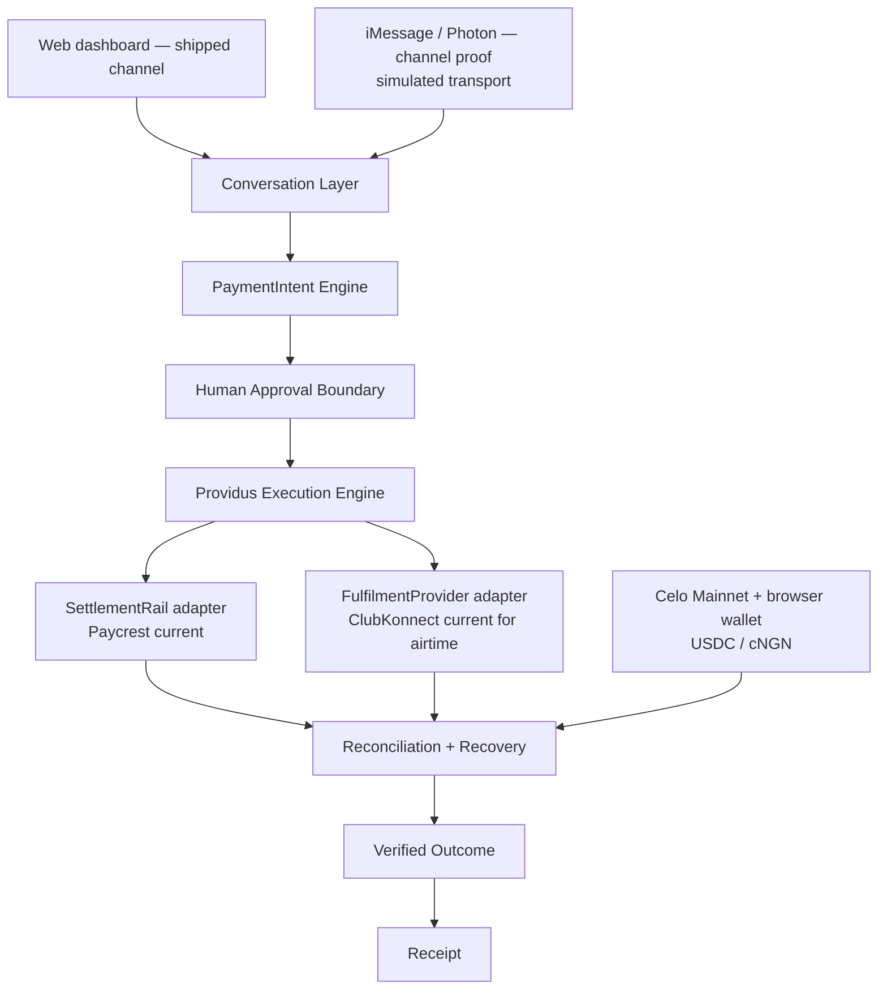

<div align="center">

# Providus

### Ask. Approve. Prove.

**Providus turns approved messages into verified real-world payments.**

A safety-first conversational payment execution layer on Celo for supported Nigerian payment flows.

<p>
  <a href="https://useprovidus.vercel.app"></a>
  <a href="https://useprovidus.vercel.app/how-it-works#trust"></a>
  <a href="https://celoscan.io/tx/0xfb952e0f2670c64cc6829d6419d736cc0ff152e8bec7fd30cbbdf837496e0ce9"></a>
</p>

<p>
  <a href="https://celo.org"></a>
  <a href="https://8004scan.io/agents/celo/9851"></a>
  <a href="https://github.com/Devendurance/useprovidus"></a>
  <a href="https://askbots.ai/p/k172fmf6cpxbq355mzsevk3vcd8epej8"></a>
  <a href="https://opensource.org/licenses/MIT"></a>
</p>

<p>
  <a href="https://useprovidus.vercel.app">Live App</a> ·
  <a href="https://useprovidus.vercel.app/dashboard">Try Providus</a> ·
  <a href="https://useprovidus.vercel.app/how-it-works#trust">How it works</a> ·
  <a href="https://useprovidus.vercel.app/receipt">Receipt</a> ·
  <a href="./docs/live-airtime-e2e.md">Live proof</a>
</p>

</div>

---
## What Providus does

A user says what should happen. Providus:

1. interprets the request and validates a structured `PaymentIntent`;
2. asks for missing or ambiguous payment-critical fields;
3. prepares the live quote, exact fees, recipient, network, and expiry;
4. waits for explicit approval before creating the provider order;
5. waits for a separate browser-wallet signature before moving the selected Celo asset;
6. verifies the exact Celo transfer and reconciles provider state;
7. triggers airtime fulfilment only once durable fiat-final truth is recorded from Paycrest's authoritative fiat-delivery condition;
8. issues a receipt showing the approved payment terms and available execution, settlement, fulfilment, and outcome evidence.

Current user-facing flows:

- **Conversational airtime (`/dashboard`)** — Nigerian MTN, Airtel, Glo, and 9mobile airtime.
- **Direct bank cash-out (`/check`)** — Celo USDC to a verified Nigerian bank account through Paycrest.
- **Receipt and status (`/receipt`)** — durable lifecycle and evidence for supported transactions.


### Supported airtime payment assets

| Asset | Celo contract | Current evidence |
|---|---|---|
| **USDC** | `0xcebA9300f2b948710d2653dD7B07f33A8B32118C` | **Live mainnet E2E proven**: Celo payment → NGN delivery → airtime delivery → receipt |
| **cNGN** | `0xF6829D7393dAe24509eb1E52eE8e572e2E271a4f` | **Implemented and test-verified**; Paycrest Celo corridor read-verified. Live cNGN E2E remains pending. |

USDC remains the default asset. cNGN is an additional airtime payment path through the same deterministic execution, reconciliation, fulfilment, and receipt engine.

## Why it exists

Conversational payments are not the hard part. Proving the real-world outcome is.

A Celo deposit, an NGN payout, and a utility-provider delivery are separate asynchronous events. A model can understand language, but it must not sign, authorize, retry an unknown mutation, or declare that a provider succeeded. Providus keeps language interpretation separate from deterministic money execution and makes each boundary visible.

> **LLM owns language; deterministic code owns money.**

## Trust architecture

```text
Web today (future iMessage / WhatsApp / Telegram / MiniPay are roadmap-only)
→ Conversation Layer
→ PaymentIntent Engine
→ Human Approval Boundary
→ Providus Execution Engine
→ two separate provider edges:
     SettlementRail / Paycrest (current)                     → supported Celo asset → NGN settlement
     FulfilmentProvider / ClubKonnect (current for airtime)  → airtime fulfilment
→ Reconciliation + Recovery
→ Verified Outcome
→ Receipt
```

Who owns what:

| Owner | Owns | Never owns |
|---|---|---|
| **User** | Approval of the exact bound terms and the browser-wallet signature | No money moves without both |
| **LLM** | Language interpretation, clarification, structured candidate data | Payment-critical fields, provider authorization, wallet signing, success states, refunds |
| **Deterministic Providus code** | `PaymentIntent` validation, quote/fee binding, execution eligibility, durable state, reconciliation, fulfilment gating, recovery, receipts | No success claim it cannot evidence |
| **Paycrest** | Supported Celo asset → NGN settlement | Fulfilment or fulfilment gating |
| **ClubKonnect** | Airtime fulfilment | When it is called, or whether its result ends the lifecycle |
| **Celo** | On-chain payment evidence | NGN delivery or utility fulfilment |
| **Neon PostgreSQL + Drizzle** | Durable transaction state | Provider truth that has not been reconciled |

Provider acknowledgement is never final success. Unknown outcomes reconcile through the durable Paycrest order reference or the deterministic ClubKonnect RequestID recorded at claim time; they are never blindly retried.

The public walkthrough — architecture diagram, LLM can/cannot, the money movement gate, the actual lifecycle, evidence chain, and recovery — is the [Trust Architecture](https://useprovidus.vercel.app/how-it-works#trust).

## Live proof

One human-gated run demonstrates the complete **request → receipt** chain on Celo mainnet:

- **Delivered:** ₦1,000 MTN airtime
- **Recipient:** `*******6560`
- **Payment asset:** USDC
- **Celo deposit:** [transaction `0xfb95…e0ce`](https://celoscan.io/tx/0xfb952e0f2670c64cc6829d6419d736cc0ff152e8bec7fd30cbbdf837496e0ce9) (Celoscan link; display shortened)
- **Amount:** `0.736312 USDC` (`0.732612` base + `0.0037` Paycrest sender fee)
- **Paycrest:** fiat delivery `validated`, then protocol `settled`
- **ClubKonnect:** provider status `200`, RequestID `cktx48b9…`, provider order `6720476887`
- **Full trace:** [`docs/live-airtime-e2e.md`](./docs/live-airtime-e2e.md)

This is one human-gated run of the current architecture — approval, Celo deposit, fiat delivery, fulfilment — not a universal guarantee for every payment, recipient, provider state, or future channel. The same chain is walked through publicly in the [Trust Architecture](https://useprovidus.vercel.app/how-it-works#trust).

## How the flow works

```text
User request
→ validated PaymentIntent
→ exact preview and provider-authoritative fee binding
→ explicit human approval
→ Paycrest order
→ browser-wallet Celo asset signature
→ on-chain deposit verification
→ Paycrest fiat-delivery reconciliation (settlement edge)
→ ClubKonnect fulfilment and reconciliation (fulfilment edge)
→ reconciliation + recovery for any unknown outcome
→ verified outcome
→ receipt
```

Fulfilment for airtime requires durable fiat-final truth rather than a raw equality check on the latest provider string. The authoritative fiat-delivery status is Paycrest `validated`; upstream `settled` also satisfies the condition because it subsumes that delivery and records protocol completion. Once fiat delivery is recorded it is monotonic — a later raw `settling` event (protocol escrow release in progress) never clears it or re-blocks fulfilment. The raw Paycrest lifecycle stays distinct and recorded: `validated` is fiat delivery, `settling` is later protocol progression, `settled` is protocol completion. A Celo deposit alone is never presented as NGN delivery.

## LLM and deterministic-money boundary

The LLM may interpret language, ask questions, and explain recorded state. It cannot:

- create an executable transaction;
- invent or silently change a recipient, amount, or network;
- authorize a provider mutation;
- sign a wallet transfer;
- choose a success state;
- invent a refund.

Deterministic code validates the `PaymentIntent`, binds fees and totals, enforces approval, persists state, calls providers, reconciles outcomes, and builds the receipt.

## Architecture



Channels do not own payment engines. The web dashboard is the shipped production channel. iMessage/Photon is a **channel proof** (simulated transport): `POST /api/channels/imessage/webhook` normalizes a Photon-style message into the same `PaymentIntent` engine, returns clarification or a web approval handoff (`/dashboard?channel=imessage`), and formats receipt/status replies from verified terminal state — execution, wallet signing, Paycrest, ClubKonnect, and receipt stay on the existing web path. WhatsApp, Telegram, MiniPay, and other surfaces remain roadmap-only adapters over the same execution path — not shipped capability. Paycrest and ClubKonnect are current infrastructure adapters at two separate edges; Providus owns intent, approval, orchestration, state, reconciliation, recovery, and proof.
For airtime, Paycrest NGN proceeds land in the configured Providus operating settlement account and ClubKonnect spends from its own prepaid float. Providus does not claim automatic Paycrest-to-ClubKonnect funding.

## Transaction lifecycle

| Internal status | Meaning |
|---|---|
| `pending` | Provider order exists; awaiting the selected Celo asset deposit. |
| `settling` | Celo deposit is verified; Paycrest fiat delivery is still pending. |
| `settled` | Internal status records the durable fiat-final milestone — set when the authoritative fiat-delivery status `validated` is observed, and never cleared afterwards, including when raw upstream state later moves through `settling` to `settled`. Upstream `settled` also satisfies the gate because it subsumes prior fiat delivery and records protocol completion. For utility transactions this enables fulfilment; for cash-out it is the effective business terminal state. |
| `processing` | ClubKonnect fulfilment is claimed or in flight. |
| `completed` | ClubKonnect returned numeric status `200`; airtime delivery is verified. |
| `failed` | A documented terminal failure occurred. |
| `refunded` | A refund was actually verified; never inferred from fulfilment failure. |

The raw Paycrest values stay distinct and are never collapsed into one success flag: `validated` is authoritative fiat delivery — it sets the durable monotonic fiat-final marker and is the point where fulfilment becomes eligible; `settling` is later protocol progression and never clears fiat delivery, never re-blocks fulfilment, and never proves completion; `settled` is protocol completion and also subsumes prior fiat delivery.

Provider acknowledgements, `deposited`, `pending`, `fulfilling`, `settling`, ClubKonnect `100`/`300`, `201`, and unknown statuses are not final delivery. Unknown outcomes require recovery/reconciliation through the original reference; they are never blind-retried.

Public stage labels shown in the product come only from `lib/transactions/status.ts` and match the `/how-it-works#trust` lifecycle: Awaiting payment · Celo deposit confirmed · NGN payout in progress · NGN settlement processing · NGN settlement confirmed · Airtime request submitting · Airtime processing · Provider status unresolved · Airtime delivered · Airtime fulfilment failed · Failed · Refunded · Recovery required (plus cash-out: Fiat delivery confirmed · Paycrest protocol settled · Completed · Fulfilment processing). The declared-but-never-emitted `deposit_confirming` identifier is not a public label and is never rendered.

## Safety and reliability

- **Non-custodial:** browser wallet signing only; no private keys or seed phrases reach the server.
- **Explicit approval:** the user approves the exact order and separately signs the exact bound asset transfer.
- **Provider fee authority:** Paycrest order creation binds sender/network fees and the final total.
- **Durable state:** Neon PostgreSQL (managed Postgres) + Drizzle records the orchestration across refreshes and restarts.
- **Celo verification:** the server checks the expected sender, recipient, token contract, and exact amount.
- **Idempotent fulfilment:** deterministic ClubKonnect RequestIDs and one-shot claims prevent duplicate purchases.
- **Conservative recovery:** ambiguous mutations are reconciled through the original reference instead of blindly retried.
- **Server-only providers:** Paycrest and ClubKonnect credentials never enter client bundles or public logs.
- **Truthful finality:** provider acknowledgement is never treated as delivery, and a Celo deposit is never treated as NGN settlement.

## Receipt and evidence model

A supported receipt brings together the requested action, approved payment terms, transaction identifier, Celo proof, Paycrest order and settlement evidence, ClubKonnect fulfilment evidence, lifecycle state, and verified outcome available for that transaction. It does not claim a standalone persisted approval event unless the product actually records and renders one.

The receipt is an evidence surface, not a promise of success. Pending, failed, recovery-required, and unknown outcomes remain visibly distinct.

Receipt reads have two distinct scopes:

- **Generic status polling** — `GET /api/transactions/[id]` without an owner scope — remains a sanitized public status response for compatibility, carrying no owner-only evidence.
- **Owner-scoped receipt reads** — an explicit `scope=receipt` request, and the opt-in payment-instruction request — must carry a valid `walletAddress`. The server checks that address against the transaction's stored wallet before reconciliation and before DTO/evidence serialization: missing or invalid context returns no transaction DTO or evidence, and a mismatch returns a generic forbidden response instead of transaction detail. The receipt UI also requests owner scope with the connected wallet and compares wallets locally, but that client check is defence-in-depth, not the authorization boundary.

ERC-8021 attribution is presented from the recorded tag and transfer evidence as “Attribution configured” (the ERC-8021 attribution tag). The receipt never renders “Verified” from the static tag alone.

## Shipped today

- Web conversational assistant with multi-turn clarification.
- Deterministic, schema-validated airtime `PaymentIntent`.
- **USDC airtime path with a completed Celo-mainnet E2E proof.**
- **cNGN airtime path implemented and test-verified; live Paycrest corridor read-verified; live cNGN E2E pending.**
- USDC remains the default payment asset.
- Celo mainnet and canonical Circle USDC.
- Explicit human approval and browser-wallet signing.
- Paycrest quotes, order creation, authoritative fee binding, and reconciliation.
- Neon PostgreSQL (managed Postgres) + Drizzle durable transaction persistence.
- ClubKonnect server boundary, readiness checks, deterministic RequestIDs, final-state handling, and reconciliation.
- Receipt/status surface limited to evidence-backed stages, with owner-scoped evidence reads.
- Separate Nigerian bank cash-out flow through Paycrest.
- ERC-8021 attribution tag `celo_8190b99392a2` on eligible transfers.
- iMessage/Photon channel proof (simulated transport): `POST /api/channels/imessage/webhook` normalizes a Photon-style message into the same `PaymentIntent` engine, returns clarification or a web approval handoff, and formats receipt/status replies from verified terminal state (`npm run test:channel`, `npx tsx scripts/imessage-channel-demo.ts`) — NOT production-supported.

## Roadmap

Roadmap-only — not shipped, not production-supported, and not current product claims:

- [ ] Data bundles
- [ ] Electricity payments
- [ ] Cable TV subscriptions
- [ ] iMessage/Photon production support (a simulated channel proof is shipped above; live delivery is not)
- [ ] WhatsApp, Telegram, MiniPay, and other channel adapters
- [ ] Additional settlement rails
- [ ] Additional fulfilment providers
- [ ] Session-key or permissioned recurring spending
- [ ] Broader remittance and multi-country support

## AskBots progression

[AskBots Round 1](https://askbots.ai/p/k172fmf6cpxbq355mzsevk3vcd8epej8) established the early public baseline.

Since that round, Providus has added deterministic validation, explicit approval, durable persistence, provider reconciliation, fulfilment idempotency, provider-authoritative fee binding, a verified receipt surface, a completed Celo-mainnet airtime E2E, and multi-asset airtime support.

Round 2 reviews the current live product rather than the earlier baseline.

## Testing

Run the repository checks:

```bash
npm run test:all
npm run lint
npx tsc --noEmit
npm run build
```

Provider and blockchain mutations are not part of local verification. Live transactions require explicit approval.

## Setup

### Prerequisites

- Node.js 20+
- Neon PostgreSQL (managed Postgres) or compatible development database
- Paycrest API key
- ClubKonnect API key
- DeepSeek API key

### Install and run

```bash
git clone https://github.com/Devendurance/useprovidus.git
cd useprovidus
npm install
npm run dev
```

Keep provider credentials server-side and out of git. Never print secrets, full bank details, or credential-bearing URLs.

## Canonical documentation

The public trust story is the [Trust Architecture](https://useprovidus.vercel.app/how-it-works#trust) (P6.14). These documents carry the same ownership, state, recovery, and roadmap semantics and are synchronized as one P6.14 set:

- [Trust Architecture](https://useprovidus.vercel.app/how-it-works#trust) — public trust section: architecture diagram, LLM can/cannot and the money movement gate, actual lifecycle, exceptional branches, evidence chain, recovery
- [`docs/PROVIDUS_ARCHITECTURE.md`](./docs/PROVIDUS_ARCHITECTURE.md) — P6.14 current architecture, ownership, state semantics, and lifecycle
- [`docs/providus_PRD.md`](./docs/providus_PRD.md) — P6.14 current product requirements
- [`docs/positioning.md`](./docs/positioning.md) — P6.14 category, promise, trust architecture, claims, and messaging hierarchy
- [`docs/competitive-positioning.md`](./docs/competitive-positioning.md) — factual competitor framing and differentiation
- [`docs/live-airtime-e2e.md`](./docs/live-airtime-e2e.md) — live execution evidence
- [`docs/providus-brand-messaging.md`](./docs/providus-brand-messaging.md) — synchronized brand application

## License

MIT © [Devendurance](https://github.com/Devendurance)
