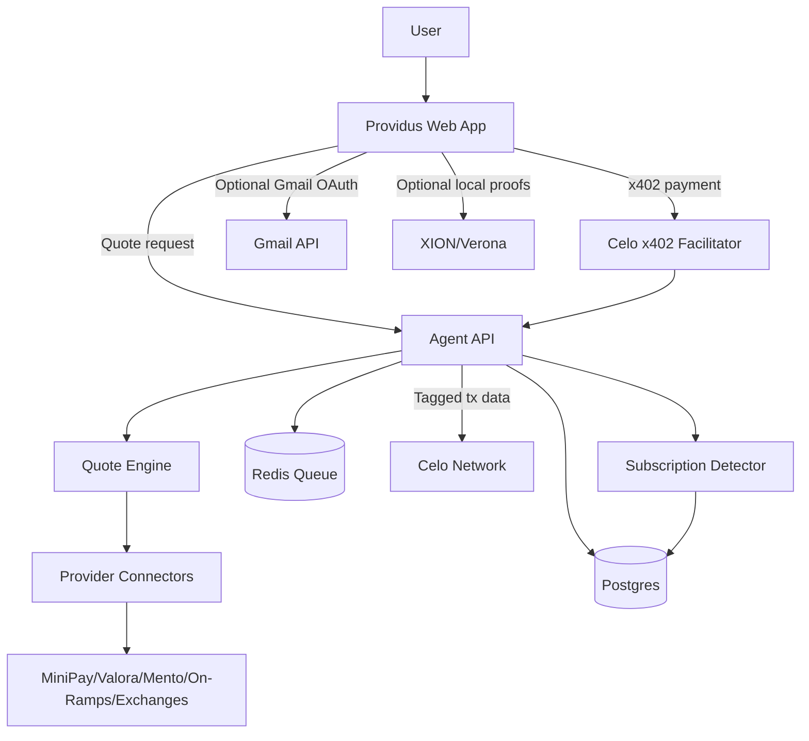

# Providus Agent Architecture

## 1. Overview

Providus Agent is a Celo-native savings agent with two modules:

- OnRamp Relay: compares fiat-to-Celo routes and recommends the cheapest reliable path.
- Subscription Saver: discovers recurring subscriptions from Gmail and supports future unsubscribe execution.

The hackathon MVP should prioritize OnRamp Relay because it directly generates Celo volume, supports attribution tags, and gives users immediate savings. Subscription Saver should be built as a secondary module using the existing unsubscribe-agent architecture.

## 2. Recommended Tech Stack

| Layer | Recommendation | Rationale |
|---|---|---|
| Frontend | SvelteKit + TypeScript | Fast, simple, mobile-first UI with low boilerplate. |
| Styling | Tailwind CSS | Rapid responsive design. |
| Backend | Fastify + TypeScript | Fast API server with strong plugin ecosystem. |
| Database | Supabase Postgres | Managed Postgres, auth option, quick launch. |
| Queue | Redis + BullMQ | Quote refreshes, Gmail scans, unsubscribe jobs. |
| Payments | x402 on Celo | Native hackathon fit and agent monetization. |
| Attribution | `@celo/attribution-tags` | Track 1 on-chain attribution. |
| Gmail | Google APIs | Subscription discovery. |
| Optional Proofs | XION/Verona | Local zkEmail proofs and subscription attestations. |
| Monitoring | Sentry + Pino | Error tracking and structured logs. |

## 3. High-Level Architecture



## 4. Core Components

### Frontend App

Responsibilities:

- Collect country, amount, currency, payment method, and target asset.
- Display locked quote preview and estimated savings.
- Initiate x402 payment for quote/action unlock.
- Show ranked route results and execution instructions.
- Display savings dashboard.
- Optional Gmail OAuth connection for subscription discovery.

### Agent API

Responsibilities:

- Validate requests.
- Verify x402 payments.
- Run route comparisons.
- Normalize quote results.
- Store quote history and savings calculations.
- Return unlocked recommendations.
- Expose x402-paid quote API for external agents.

### Quote Engine

Responsibilities:

- Fetch quote data from route providers.
- Normalize all routes to effective received amount.
- Score routes by total cost, speed, reliability, limit fit, and Celo compatibility.
- Cache quotes with short TTLs.
- Explain ranking transparently.

### Subscription Saver

Responsibilities:

- Use Gmail OAuth read-only access.
- Detect subscription-like emails.
- Extract sender, subject, date, domain, unsubscribe link, and billing cues.
- Avoid long-term storage of full email bodies.
- Support future unsubscribe execution and XION/Verona proof verification.

## 5. Backend Project Structure

```text
agent/
├── src/
│   ├── config/
│   │   └── index.ts
│   ├── controllers/
│   │   ├── quotes.controller.ts
│   │   ├── payments.controller.ts
│   │   ├── subscriptions.controller.ts
│   │   ├── unsubscribe.controller.ts
│   │   └── dashboard.controller.ts
│   ├── middleware/
│   │   ├── auth.middleware.ts
│   │   ├── rate-limit.middleware.ts
│   │   └── x402.middleware.ts
│   ├── routes/
│   │   └── index.ts
│   ├── services/
│   │   ├── quote-engine.service.ts
│   │   ├── provider-registry.service.ts
│   │   ├── x402.service.ts
│   │   ├── celo-attribution.service.ts
│   │   ├── gmail.service.ts
│   │   ├── subscription-detector.service.ts
│   │   ├── unsubscribe.service.ts
│   │   ├── xion.service.ts
│   │   └── dashboard.service.ts
│   ├── providers/
│   │   ├── minipay.provider.ts
│   │   ├── valora.provider.ts
│   │   ├── mento.provider.ts
│   │   ├── exchange.provider.ts
│   │   └── manual.provider.ts
│   ├── jobs/
│   │   ├── quote-refresh.job.ts
│   │   ├── gmail-scan.job.ts
│   │   └── unsubscribe.job.ts
│   ├── utils/
│   │   ├── money.ts
│   │   ├── route-score.ts
│   │   ├── subscription-detector.ts
│   │   └── logger.ts
│   └── types/
│       └── index.ts
├── tests/
├── package.json
└── README.md
```

## 6. Data Model

### users

| Field | Type | Notes |
|---|---|---|
| id | uuid | Primary key. |
| wallet_address | text | Celo wallet address. |
| email | text | Optional. |
| country | text | User default country. |
| created_at | timestamptz | Created timestamp. |

### quote_requests

| Field | Type | Notes |
|---|---|---|
| id | uuid | Primary key. |
| user_id | uuid | Nullable for API users. |
| country | text | User-selected country. |
| fiat_currency | text | Example: NGN, KES, BRL, USD. |
| fiat_amount | numeric | Amount entered. |
| payment_method | text | Card, bank, mobile_money, etc. |
| target_asset | text | cUSD, USDC, CELO, etc. |
| status | text | pending, paid, completed, failed. |
| created_at | timestamptz | Created timestamp. |

### route_quotes

| Field | Type | Notes |
|---|---|---|
| id | uuid | Primary key. |
| quote_request_id | uuid | Parent request. |
| provider | text | Provider name. |
| route_type | text | wallet, exchange, onramp, manual. |
| estimated_received | numeric | Target asset amount. |
| total_fee | numeric | Explicit provider fee. |
| fx_spread | numeric | Estimated hidden spread. |
| settlement_minutes | integer | Estimated settlement time. |
| reliability_score | numeric | Internal 0-1 score. |
| rank | integer | Ranking position. |
| execution_url | text | Deep link or provider URL. |
| expires_at | timestamptz | Quote TTL. |

### payments

| Field | Type | Notes |
|---|---|---|
| id | uuid | Primary key. |
| user_id | uuid | Paying user. |
| quote_request_id | uuid | Optional related quote. |
| payment_type | text | quote_unlock, api_quote, subscription_scan, unsubscribe. |
| amount_usd | numeric | Payment amount. |
| token | text | USDC/cUSD/etc. |
| chain_id | integer | Celo chain ID. |
| tx_hash | text | Settlement transaction hash. |
| attribution_tag | text | Assigned Celo tag. |
| status | text | verified, settled, failed. |
| created_at | timestamptz | Created timestamp. |

### savings_events

| Field | Type | Notes |
|---|---|---|
| id | uuid | Primary key. |
| user_id | uuid | User. |
| quote_request_id | uuid | Related quote. |
| baseline_cost | numeric | Worst/default route cost. |
| selected_cost | numeric | Recommended route cost. |
| estimated_savings | numeric | Difference. |
| currency | text | Savings currency. |
| created_at | timestamptz | Created timestamp. |

### subscription_candidates

| Field | Type | Notes |
|---|---|---|
| id | uuid | Primary key. |
| user_id | uuid | User. |
| sender | text | Email sender. |
| domain | text | Sender domain. |
| subject_hash | text | Hash or redacted subject. |
| detected_reason | text | Rule/heuristic reason. |
| unsubscribe_url | text | Optional extracted link. |
| estimated_monthly_cost | numeric | Optional. |
| status | text | active, ignored, cancelled, failed. |
| created_at | timestamptz | Created timestamp. |

## 7. API Endpoints

### Quote And Routing

| Method | Endpoint | Auth | Payment | Description |
|---|---|---|---|---|
| POST | `/api/quotes/preview` | Optional | No | Return locked preview and estimated savings range. |
| POST | `/api/quotes/unlock` | Wallet/JWT | x402 | Verify payment and return full ranked routes. |
| GET | `/api/quotes/:id` | Wallet/JWT | No | Fetch quote result. |
| POST | `/api/agent/quote` | API key | x402 | x402-paid quote endpoint for agents/apps. |

### Payments

| Method | Endpoint | Auth | Description |
|---|---|---|---|
| POST | `/api/payments/verify` | Optional | Verify x402 payment payload. |
| GET | `/api/payments/:id` | Wallet/JWT | Check payment status. |

### Subscriptions

| Method | Endpoint | Auth | Payment | Description |
|---|---|---|---|---|
| POST | `/api/subscriptions/connect-gmail` | JWT | No | Start Gmail OAuth. |
| POST | `/api/subscriptions/scan` | JWT | x402 optional | Start subscription scan job. |
| GET | `/api/subscriptions/candidates` | JWT | No | Return detected subscriptions. |
| POST | `/api/unsubscribe/execute` | JWT | x402 | Future unsubscribe execution. |

### Dashboard

| Method | Endpoint | Auth | Description |
|---|---|---|---|
| GET | `/api/dashboard/me` | Wallet/JWT | User savings dashboard. |
| GET | `/api/dashboard/public` | None | Public hackathon stats. |

## 8. x402 Payment Flow

1. User requests a locked quote preview.
2. Backend returns estimated savings range and required x402 payment details.
3. Frontend initiates x402 payment on Celo.
4. Backend verifies payment through the Celo x402 facilitator.
5. Backend confirms amount, recipient, token, network, and action ID.
6. Backend unlocks route details or processes the requested agent action.
7. Payment record is stored with settlement transaction hash.

## 9. Celo Attribution Tag Flow

1. Register project through the Celo Builders skill to receive the assigned `celo_...` tag.
2. Store the assigned tag in `CELO_ATTRIBUTION_TAG`.
3. Use `@celo/attribution-tags` to append the tag to supported outbound transaction data.
4. Store transaction hashes and tags in the `payments` table.
5. Surface tagged transaction links in the hackathon dashboard.

## 10. Quote Scoring

Route ranking should optimize for the user's actual received value.

Suggested score:

```text
score =
  normalized_received_amount * 0.50 +
  low_fee_score * 0.20 +
  reliability_score * 0.15 +
  speed_score * 0.10 +
  celo_native_bonus * 0.05
```

Effective received amount should include:

- Explicit provider fee.
- FX spread.
- Network fee.
- Minimum/maximum limits.
- Estimated settlement slippage or stale quote penalty.

## 11. Provider Connector Interface

```typescript
export interface QuoteProvider {
  id: string;
  name: string;
  supportedCountries: string[];
  supportedPaymentMethods: string[];
  supportedAssets: string[];
  getQuote(input: QuoteInput): Promise<RouteQuote[]>;
}
```

Manual providers can be used during the hackathon where APIs are unavailable. They should clearly mark quotes as estimated and include timestamped assumptions.

## 12. Security And Privacy

### Payment Security

- Always verify x402 payments server-side before returning unlocked routes.
- Validate payment amount, token, recipient, network, and action ID.
- Prevent replay by binding payments to quote request IDs.
- Rate limit quote previews and paid API requests.

### Gmail Privacy

- Use Gmail read-only scope only.
- Do not store full email bodies.
- Store only redacted metadata and hashes where possible.
- Encrypt OAuth tokens if stored temporarily.
- Allow users to disconnect Gmail and delete scan results.

### Backend Security

- Validate all inputs with Zod.
- Use structured logging without secrets.
- Keep provider API keys server-side only.
- Add per-IP and per-wallet rate limits.
- Add audit logs for paid actions.

## 13. Environment Variables

```env
# App
NODE_ENV=
APP_URL=
API_URL=

# Database
DATABASE_URL=
SUPABASE_URL=
SUPABASE_SERVICE_ROLE_KEY=

# Redis
REDIS_URL=

# Celo + x402
CELO_RPC_URL=
CELO_CHAIN_ID=
X402_FACILITATOR_URL=https://x402.celo.org
X402_PAY_TO_ADDRESS=
QUOTE_UNLOCK_PRICE_USD=0.05
SUBSCRIPTION_SCAN_PRICE_USD=0.10
UNSUBSCRIBE_PRICE_USD=0.50
CELO_ATTRIBUTION_TAG=

# Google
GOOGLE_CLIENT_ID=
GOOGLE_CLIENT_SECRET=
GOOGLE_REDIRECT_URI=

# Optional XION/Verona
XION_RPC_URL=
XION_CHAIN_ID=

# Security
JWT_SECRET=
ENCRYPTION_KEY=
AGENT_PRIVATE_KEY=
```

## 14. Implementation Phases

### Phase 1: Foundation

- Initialize SvelteKit frontend and Fastify backend.
- Set up Supabase Postgres schema.
- Add wallet/JWT session model.
- Add x402 payment verification middleware.
- Add public dashboard shell.

### Phase 2: OnRamp Relay MVP

- Implement quote input form.
- Implement provider connector interface.
- Add two to four initial route providers/manual connectors.
- Add quote normalization and scoring.
- Add x402 quote unlock flow.
- Add savings events and dashboard metrics.
- Add Celo attribution tag support.

### Phase 3: Subscription Saver

- Add Google OAuth read-only flow.
- Add Gmail scan job.
- Implement subscription detector heuristics.
- Store redacted subscription candidates.
- Add subscription dashboard UI.

### Phase 4: Hackathon Polish

- Add public stats page for tagged Celo volume and x402 count.
- Add shareable savings receipt.
- Add demo seed routes for target countries.
- Add error handling and empty states.
- Add basic tests for quote scoring and payment verification.

### Phase 5: Post-Hackathon Scale

- Add more countries and providers.
- Add quote reliability feedback loop.
- Add x402 API keys for external agents.
- Add XION/Verona proof layer.
- Add automated unsubscribe execution where safe.

## 15. Testing Plan

### Unit Tests

- Quote normalization.
- Route scoring.
- Savings calculations.
- Subscription detection heuristics.
- x402 payment payload validation.

### Integration Tests

- Quote preview to unlock flow.
- Payment verification middleware.
- Gmail scan job with mocked Gmail responses.
- Dashboard aggregation queries.

### Manual Tests

- Mobile quote flow.
- Celo wallet payment flow.
- Attribution-tagged transaction flow.
- Gmail OAuth consent and disconnect.

## 16. Key Technical Decisions

### Avoid Custody In MVP

Providus should recommend and deep-link routes, not custody user funds or execute fiat purchases directly. This avoids regulatory and operational complexity while still producing real user value.

### Optimize For Effective Received Amount

The best route is not the provider with the lowest headline fee. Ranking must include FX spread, network fees, limits, settlement speed, and reliability.

### Keep Gmail Optional

On-ramp savings should work without Gmail. Subscription discovery is a secondary savings action and should not block the core flow.

### Use x402 For Every Paid Agent Action

x402 is both monetization and hackathon alignment. Quote unlocks, subscription scans, unsubscribe batches, and API quote requests should all be payable through x402.

## 17. Getting Started

```bash
# Frontend
npm create svelte@latest providus-web
cd providus-web
npm install

# Backend
mkdir providus-agent
cd providus-agent
npm init -y
npm install fastify zod pino dotenv @supabase/supabase-js bullmq ioredis googleapis
npm install -D typescript tsx vitest @types/node
```

Use the Celo x402 facilitator at `https://x402.celo.org` and register early through the Celo Builders skill so the assigned attribution tag can be included before any tracked transactions are generated.
